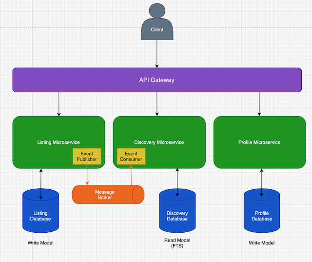

# Bartering Platform

---

## Overview

Bartering Platform is an inherited full-stack **.NET 8 microservices** and **Angular** event-driven web application designed to facilitate the exchange of goods between users, featuring arhcitecural patterns/tools such as CQRS, Clean Architecture, and RabbitMQ messaging.

Users have the ability to create/edit/delete listings, search & discover listings for a specified location, and manage their profiles after authentication.

Once the CQRS scaffold was recieved, I refactored the Listing Service to a service + repository approach to establish tradeoffs between the two patterns and get hands-on with the arhcitecure to build an understanding. Now the system is documented end-to-end and my understanding is solidified, I plan to add user-messaging capabilities, and refine exisiting microservices, exploring potential for a full-event driven design and replacing persistece requirements to relational databases.

---

## Technologies Used
- **Backend**: .NET 8, ASP.NET Core, EF Core, SQL Server 2022, RabbitMQ
- **Gateway**: Ocelot
- **Frontend**: Angular
- **Container/dev**: Docker, Docker Compose
- **Authentication**: Firebase JWT


---

## Architecture



Services are loosely coupled and independently deployable, with functionality encapsulated within several NET class libraries:

- **ApiGatewayService**: Central entry point for client requests, routing to appropriate backend services.
- **ListingService**: Handles listing commands (create/update/delete), persisting to its own database alongside publishing listing integration events to RabbitMQ.
- **DiscoveryService**: Consumes listing integration events and projects data into a search-optimised table indexed by SQL Server Full-Text-Search (FTS), which is queried by exposed search endpoints.
- **ProfileService**: A separate bounded context handling user profiles and related data.

**Command Query Responsibility Segragation** (CQRS) is adhered to within the microservices architecture, maintaining a strong read/write separation within the application's backend. The pattern is implemented using MediatR handlers to encapsulate logic fullfilling change of state requests expressed through Command classes, and reading of state expressed through Query classes.

The Listing Service's architecture was simplified to a **service + repository** approach within the `main` branch. Controllers accept request DTOs and call application service methods. A clear command/query separation remains without a mediators.

Both the handlers and service methods within each pattern enforce domain rules via the Listing aggregate and persist via a repository.

The unconverted CQRS-heavy approach can be viewed within the `cqrs` branch

### Asynchronous integration (RabbitMQ)
Both versions persist via repositories and use **RabbitMQ** to decouple services:
- **Exchange:** `listing.events` (topic) with keys `listing.created`, `listing.updated`, `listing.deleted`
- **Consumer:** **DiscoveryService** subscribes (`listing.*`) and updates its search index
This enables resilience (messages queue if a service is offline) and loose coupling between write and read concerns.

---

## Setup Instructions

### Prerequisites
- [Docker](https://www.docker.com/) (to run full-stack) or [.NET 8 SDK](https://dotnet.microsoft.com/en-us/download/dotnet/8.0) (to run services locally)
- [Node.js](https://nodejs.org/) + [Angular CLI](https://angular.dev/tools/cli) (for frontend)

### Run with Docker

1. Copy environment variables (Docker Compose):
    ```
    cp deploy/.env.example deploy/.env
    ```
   Fill the required values in `.env`

2. From `deploy/`, start all services:
    ```
    docker compose up -d
    ```

3. (Optional) view logs:
    ```
    docker compose logs -f
    ```
Default endpoints:
- API Gateway: http://localhost:8080
- RabbitMQ UI: http://localhost:15672 (use credentials from .env)
- SQL Server: localhost,1433 (login sa + password from .env)

### Run without Docker

1. Copy the development settings file (within `Web/` of each service):
    ```
    cp appsettings.Development.json.example appsettings.Development.json
    ```
    Fill in local values.

2. In separate terminals:

    ```
    cd ListingService/Web   && dotnet run
    cd DiscoveryService/Web && dotnet run
    cd ProfileService/Web   && dotnet run
    cd ApiGatewayService/Web&& dotnet run

    ```

**Frontend:**

1. Navigate to the `BarterApp` directory

2. Start the development server:
    ```
    ng serve
    ```

---

## License

*Specify license here*

---
## Contributing

**Contributions are welcome!**  
Please fork the repository and submit a pull request with your changes.

---

## Contact

For any questions or feedback, feel free to reach out:

- **Email:** matty.tom@icloud.com
- **GitHub:** [Mattytomo365](https://github.com/Mattytomo365)
