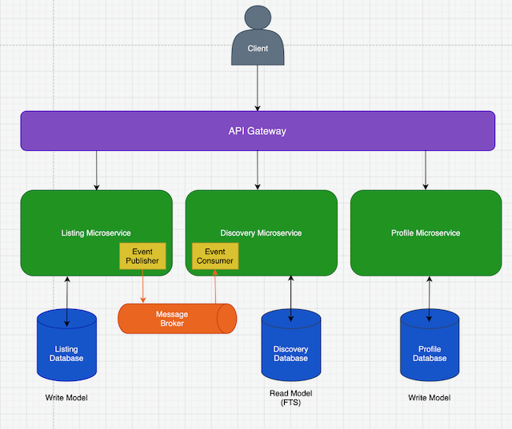

# Bartering Platform

---

## Overview

A full-stack **.NET 8 microservices** and **Angular** event-driven web application designed to facilitate the exchange of goods between users, featuring arhcitectural patterns/tools such as CQRS, Clean Architecture, Docker, and RabbitMQ-based messaging.

Authenticated users have access to listing CRUD operations, searching & discovering listings for a specified location, and profile management.

The project began from an inherited CQRS scaffold. The Listing Service was refactored to a service + repository approach to establish tradeoffs between the two patterns and their architectural differences, whilst retaining clear command and query separation where appropriate.

All progress is tracked through my `Bartering-Platform` GitHub project instance using a Kanban-style workflow. 

The application's runtime is currently being containerised to provide a reproducible full-stack local environment whilst preserving existing host-based development workflows. Unit tests will then be actively applied across backend API and frontend user workflows, followed by GitHub Actions pipelines for automated build and test execution.

This project is ultimately working towards a full-event driven design with event sourcing for listings with pipelines to manage dependencies, solution building, and test running.

---

## Technologies Used
- **Backend**: .NET 8, ASP.NET Core, EF Core, SQL Server 2022, RabbitMQ
- **Gateway**: Ocelot
- **Frontend**: Angular
- **Container/dev**: Docker, Docker Compose
- **Authentication**: Firebase JWT

---

## Architecture



Services are loosely coupled and independently deployable, with functionality encapsulated within several NET class libraries:

- **ApiGatewayService**: Central entry point for client requests, routing to appropriate backend services.
- **ListingService**: Handles listing commands (create/update/delete), persisting to its own database alongside publishing listing integration events to RabbitMQ.
- **DiscoveryService**: Consumes listing integration events and projects data into a search-optimised table indexed by SQL Server Full-Text-Search (FTS), which is queried by exposed search endpoints.
- **ProfileService**: A separate bounded context handling user profiles and related data.

### Command Query Responsibility Segragation 
CQRS is adhered to within the microservices architecture, maintaining a strong read/write separation within the application's backend. The pattern is implemented using MediatR handlers to encapsulate logic fullfilling change of state requests expressed through Command classes, and reading of state expressed through Query classes.

The Listing Service's architecture was simplified to a **service + repository** approach within the `main` branch. Controllers accept request DTOs and call application service methods. A clear command/query separation remains without a mediators.

Both the handlers and service methods within each pattern enforce domain rules via the Listing aggregate and persist via a repository.

The unconverted CQRS-heavy approach can be viewed within the `cqrs` branch

### Asynchronous integration (RabbitMQ)
Both versions persist via repositories and use **RabbitMQ** to decouple services:
- **Exchange:** `listing.events` (topic) with keys `listing.created`, `listing.updated`, `listing.deleted`
- **Consumer:** **DiscoveryService** subscribes (`listing.*`) and updates its search index
This enables resilience (messages queue if a service is offline) and loose coupling between write and read concerns.

### Docker
Originally, only infrastructure dependencies e.g., RabbitMQ & SQL Server were orchestrated through Docker, with all microservices, API gateway, and frontend ran directly on the development machine. 

The containerisation of the application's wider architecture allows for services to be packaged into consistent, isolated environments, through multi-stage Dockerfiles, networked together and co-ordinated via Docker Compose.

---

## Setup Instructions

### Prerequisites
- [Docker](https://www.docker.com/) (to run full-stack) or [.NET 8 SDK](https://dotnet.microsoft.com/en-us/download/dotnet/8.0) (to run services locally)
- [Node.js](https://nodejs.org/) + [Angular CLI](https://angular.dev/tools/cli) (for frontend)

### Run with Docker Compose

Docker Compose can build and coordinate the backend application stack, including:

- API Gateway
- Listing Service
- Discovery Service
- Profile Service
- SQL Server
- RabbitMQ

1. Create the local Docker environment file:
    ```
    cp deploy/.env.example deploy/.env
    ```
   Fill the required values in `.env`

2. From `deploy/`, build and start the containers:
    ```
    docker compose up --build -d
    ```

3. (Optional) view logs:
    ```
    docker compose logs -f
    ```

4. Stop the stack:
    ```
    docker compose down
    ```

Default endpoints:
- API Gateway: http://localhost:5039
- Listing Service: http://localhost:5093
- Discovery Service: http://localhost:5084
- Profile Service: http://localhost:5114
- RabbitMQ Management UI: http://localhost:15672
- SQL Server: localhost,1433

### Run without Docker
1. Start the infrastructure dependencies:
    ```
    cd deploy
    docker compose up -d sql rabbitmq
    ```

2. Copy the development settings file (within `Web/` of each service):
    ```
    cp appsettings.Development.json.example appsettings.Development.json
    ```
    Fill in local values.

3. In separate terminals:

    ```
    cd ListingService/Web   && dotnet run
    cd DiscoveryService/Web && dotnet run
    cd ProfileService/Web   && dotnet run
    cd ApiGatewayService/Web&& dotnet run

    ```

**Frontend:**

1. Navigate to the `BarterApp` directory

2. Install dependencies if requred
    ```
    npm install
    ```

3. Start the development server:
    ```
    ng serve
    ```

---
## Contributing

**Contributions are welcome!**  
Please fork the repository and submit a pull request with your changes.

---

## Contact

For any questions or feedback, feel free to reach out:

- **Email:** matty.tom@icloud.com
- **GitHub:** [Mattytomo365](https://github.com/Mattytomo365)
